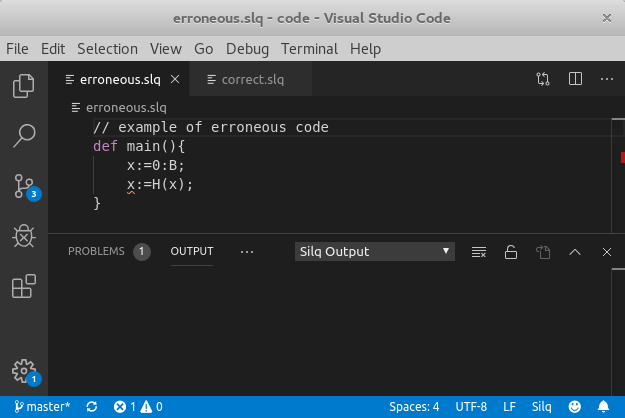
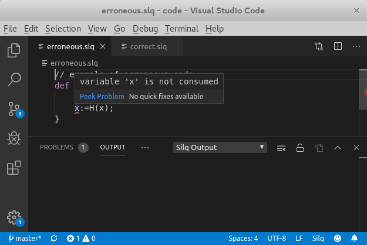

## Recommended: Visual Studio Code Plugin

The recommended way to install Silq is by using its
[vscode](https://code.visualstudio.com/) plugin. This approach works for Linux,
Mac, and Windows.

### Install Visual Studio Code

First, install the general-purpose editor `vscode`, e.g., by following these
instructions:
- [Linux instructions](https://code.visualstudio.com/docs/setup/linux#_installation)
- [Mac instructions](https://code.visualstudio.com/docs/setup/mac)
- [Windows instructions](https://code.visualstudio.com/docs/setup/windows)

### Install Plugin

Follow these instructions to install Silq's vscode plugin (more details on
installing plugins can be found
[here](https://code.visualstudio.com/docs/editor/extension-gallery)):

- Open `vscode`
- Open tab extensions (`Ctrl+Shift+X`)
- Install `vscode-silq`

For more details on this plugin, see the extension's [GitHub
repository](https://github.com/eth-sri/vscode-silq).

### Unicode Input

We additionally recommend you follow our instructions on [typing unicode
symbols](./documentation#/documentation/7_symbols) (useful when writing Silq
programs).

### Start Programming

To start programming, just create a file with extension `.slq`, and populate it
with code, e.g.:

```
def main() {
  x:=0:𝔹;
  return H(x);
}
```

### Run Type-Check

Type-checking now happens automatically, on save or on pressing `F5`:





### Run Program

Programs with a `main` function can be run (i.e., simulated) by pressing `F5`
(see "Silq output" below):


## Alternative: Install from GitHub

You can also compile Silq from its GitHub source code:
[https://github.com/eth-sri/silq](https://github.com/eth-sri/silq).

The following instructions are targeted for Ubuntu, but should also work for
other Linux distributions or Mac.

### Prerequisites

The following prerequisites are usually already installed on your system. If
not, run (on Ubuntu)

```bash
sudo apt-get install -y build-essential git wget unzip
```

### Install Silq

Run these instructions to install Silq:

```bash
git clone https://github.com/eth-sri/silq.git # clone the repository
cd silq && ./dependencies.sh && ./build.sh # download dependencies and build project
# [ignore compilation warnings]
```

Now, you can run `silq` by

```bash
/path/to/silq/silq
# (expected) error: no input files
```

### Add Silq to Path

Optionally, you may also add the Silq binary to your path. This enables typing
`silq` anywhere, regardless of the current directory:

```bash
# Typically not needed: create directory
sudo mkdir -p /usr/local/bin
# make sure the current directory is `/path/to/silq`
sudo ln -s $(pwd)/silq /usr/local/bin/silq
```

Then, you can just run `silq` anywhere:

```bash
silq
# (expected) error: no input files
```

In the following, we assume you have followed this step. Otherwise, you have to
call `silq` using its full path, e.g., `/path/to/silq`.

### Run Type-Check

This command type-checks an erroneous program:

```bash
# create a file `erroneous` with a type error:
echo "def main(){ x:=H(false); }" > erroneous.slq
silq erroneous.slq # type-check the created file
# Expected error message:
# erroneous.slq:1:13: error: variable 'x' is not consumed
# def main(){ x:=H(false); }
```

### Run Program

This command type-checks a correct program and simulates it:

```bash
# Create a correct Silq file:
echo "def main(){ x:=H(false); return measure(x); }" > correct.slq
silq correct.slq # type-check the correct file
# [no output]
silq correct.slq --run # run the correct file
# Outputs 0 or 1
```
